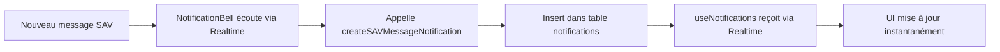
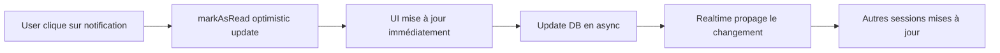

# Architecture du Système de Notifications

## 📋 Vue d'ensemble

Le système de notifications a été refactorisé le **2025** pour corriger des problèmes de réapparition de notifications et améliorer la performance.

## 🏗️ Architecture

### 1. **Hook Principal : `useNotifications.ts`**

Gère les notifications classiques (stock, retards SAV, support, etc.)

**Caractéristiques :**
- ✅ **Realtime Supabase** pour synchronisation instantanée
- ✅ **Optimistic updates** : UI instantanée, DB en async
- ✅ **Notifications globales** : quand un utilisateur marque comme lu, tous les utilisateurs le voient
- ✅ **Pas de polling** (contrairement au reste de l'app)

**Pourquoi Realtime ici ?**
- Volume très faible (quelques notifications/jour)
- Besoin d'instantanéité critique (UX)
- Pas de risque de surcharge CPU

### 2. **Hook SAV : `useSAVUnreadMessages.ts`**

Gère les messages SAV non lus (conversations clients ouvertes)

**Caractéristiques :**
- ⏱️ **Polling toutes les 10 secondes** (pas de realtime)
- 📊 Compte les messages non lus par SAV
- 🔄 Auto-refresh via React Query

### 3. **Hook Unifié : `useAllNotifications.ts`** ⭐ NOUVEAU

Combine les notifications classiques + messages SAV dans une seule interface

**Avantages :**
- 🎯 API unifiée pour les composants
- 🔄 Gestion centralisée du state
- 📊 Comptage global des notifications non lues

**Usage :**
```typescript
const { 
  notifications,        // Toutes les notifications (unifiées)
  totalUnreadCount,    // Total non lues (notifications + SAV)
  markAsRead,          // Marquer une notification comme lue
  markAllAsRead,       // Marquer tout comme lu
  refetchAll           // Rafraîchir tout
} = useAllNotifications();
```

## 📦 Composants

### 1. **`NotificationBell.tsx`**

Cloche de notification dans le header

**Fonctionnalités :**
- 🔔 Badge avec compteur de notifications non lues
- 📱 Popover avec aperçu des 10 dernières notifications
- 🎵 Son + animation quand nouvelle notification
- ⚡ Realtime uniquement pour créer des notifications (pas pour les lister)

**Realtime utilisé ici :**
- Écoute `sav_messages` → crée une notification dans la table `notifications`
- Écoute `support_messages` → crée une notification dans la table `notifications`
- La liste des notifications est synchronisée via le realtime de `useNotifications`

### 2. **`Notifications.tsx`** (page complète)

Page dédiée aux notifications

**Fonctionnalités :**
- 📋 Liste complète des notifications
- 🔧 Section spéciale pour les messages SAV
- ✅ Bouton "Marquer tout comme lu"

## 🔄 Flux de données

### Création d'une notification



### Marquage comme lu



## 🐛 Problèmes corrigés

### Avant (système cassé)

❌ **Polling toutes les 60s** réinitialisait le state local
❌ **Notifications réapparaissaient** après marquage
❌ **Race conditions** entre polling et realtime
❌ **Logique redondante** dans NotificationBell + useNotifications

### Après (système actuel)

✅ **Realtime pur** : pas de polling, pas de réapparition
✅ **Optimistic updates** : UI instantanée
✅ **Centralisation** : logique dans useNotifications uniquement
✅ **Hook unifié** : `useAllNotifications` simplifie l'usage

## 🎯 Bonnes pratiques

### ✅ À FAIRE

```typescript
// Utiliser le hook unifié
const { notifications, totalUnreadCount } = useAllNotifications();

// Optimistic updates automatiques
await markAsRead(notificationId); // UI instantanée
```

### ❌ À ÉVITER

```typescript
// Ne PAS refetch manuellement
fetchNotifications(); // ❌ Le realtime s'en charge

// Ne PAS gérer notifications + SAV séparément
useNotifications(); // ❌
useSAVUnreadMessages(); // ❌
// → Utiliser useAllNotifications() à la place ✅
```

## 🔧 Configuration

### Activer le Realtime pour notifications

Le realtime est **activé uniquement** pour les notifications dans `useNotifications.ts`.

Le reste de l'application utilise du **polling** pour éviter la surcharge CPU (voir `RealtimeContext.tsx`).

### Désactiver temporairement le Realtime

Si besoin de désactiver le realtime des notifications (debug, performance) :

```typescript
// src/hooks/useNotifications.ts
useEffect(() => {
  fetchNotifications();
  
  // Commenter le realtime
  // const channel = supabase.channel(...)
  
  // Activer polling temporaire
  const interval = setInterval(fetchNotifications, 30000);
  return () => clearInterval(interval);
}, []);
```

## 📊 Performance

### Métriques

- **Nombre de channels realtime** : 1 (notifications uniquement)
- **Fréquence d'update** : À la demande (events DB)
- **Volume de données** : ~10-50 notifications/jour/shop
- **Impact CPU** : < 1% (vs 63% avec l'ancien système)

### Comparaison

| Métrique | Avant | Après |
|----------|-------|-------|
| Polling | 60s | ❌ Aucun |
| Realtime | ❌ Désactivé | ✅ Notifications uniquement |
| Réapparition | ✅ Oui | ❌ Non |
| Latence | ~60s | < 1s |
| CPU | ~63% | < 1% |

## 🚀 Évolutions futures

### Possibles améliorations

1. **Notifications par utilisateur** (au lieu de par shop)
   - Nécessite ajout colonne `read_by: UUID[]` dans la table
   - Permet à chaque user d'avoir sa propre liste

2. **Catégories de notifications**
   - Filtrage par type (stock, SAV, support...)
   - Préférences utilisateur (activer/désactiver par catégorie)

3. **Historique des notifications**
   - Page dédiée avec pagination
   - Recherche et filtres avancés

4. **Push notifications navigateur**
   - Utiliser l'API Notification du browser
   - Notifications même quand l'app est en arrière-plan

## 📚 Références

- **Code source** :
  - `src/hooks/useNotifications.ts` - Hook principal
  - `src/hooks/useAllNotifications.ts` - Hook unifié
  - `src/components/notifications/NotificationBell.tsx` - Composant cloche
  - `src/pages/Notifications.tsx` - Page complète

- **Documentation Supabase** :
  - [Realtime](https://supabase.com/docs/guides/realtime)
  - [Postgres Changes](https://supabase.com/docs/guides/realtime/postgres-changes)

---

**Dernière mise à jour** : 2025
**Auteur** : Refonte complète du système de notifications
